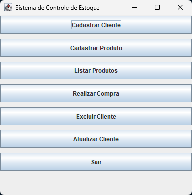
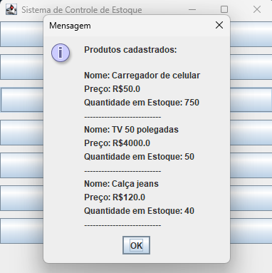

# 🛒 Sistema de Controle de Estoque e Clientes

Sistema desktop desenvolvido em **Java Swing** para gerenciar clientes (Pessoa Física e Jurídica), produtos e estoque.  
Permite cadastro, listagem, atualização, exclusão e realização de compras com validação de CPF/CNPJ e controle de estoque.

## 🖥️ Interface do Sistema

### Tela principal com todos os botões


### Exemplo de cadastro de produto


## ⚙️ Funcionalidades

| Módulo          | Ações                                                                 |
|----------------|-----------------------------------------------------------------------|
| **Clientes**   | Cadastrar PF/PJ, listar, atualizar dados (nome, endereço, telefone), excluir por nome |
| **Produtos**   | Cadastrar (nome, preço, quantidade), listar todos, realizar compra (reduz estoque) |
| **Compras**    | Verifica estoque disponível, lança exceção `EstoqueInsuficienteException` |
| **Validações** | CPF/CNPJ com formato (regex); dados inválidos disparam `DadosInvalidosException` |

## 🧱 Estrutura do Projeto
.
├── Cliente.java # Classe abstrata
├── PessoaFisica.java # Cliente PF
├── PessoaJuridica.java # Cliente PJ
├── Produto.java # Produto + estoque
├── Compra.java # Histórico de compra (usado em PF)
├── ControleClientes.java # Lógica de CRUD clientes (GUI)
├── ControleProdutos.java # Lógica de CRUD produtos e compra (GUI)
├── SistemaGUI.java # Janela principal (entry point)
├── Main.java # (Opcional) testes no console
├── ExcluirCliente.java # (Não utilizado – exclusão por documento)
├── projetofaculdade/ # Exceções personalizadas
│ ├── DadosInvalidosException.java
│ └── EstoqueInsuficienteException.java
└── prints/ # Imagens do README
├── layout.png
└── layout2.png

text

## ▶️ Como Executar

1. **Compilar todos os arquivos** (estando na raiz do projeto):
   ```bash
   javac *.java projetofaculdade/*.java
Executar a interface gráfica:

bash
java SistemaGUI
✅ Recomendação: Utilize SistemaGUI para a experiência completa. O arquivo Main.java executa testes manuais no console e pode ser ignorado.

📋 Exemplo de Uso
Cadastrar cliente → escolha PF ou PJ, preencha os dados.

Cadastrar produto → nome, preço e quantidade inicial.

Realizar compra → informe o nome do produto e a quantidade desejada. Se houver estoque, a quantidade é abatida.

Listar produtos → visualiza todos os produtos com preço e estoque.

Atualizar cliente → informe o nome e altere os dados desejados.

Excluir cliente → informe o nome para remover.

